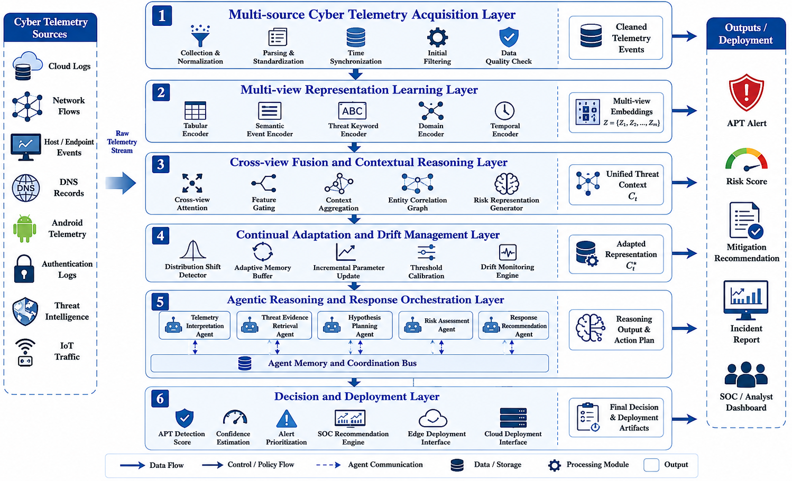
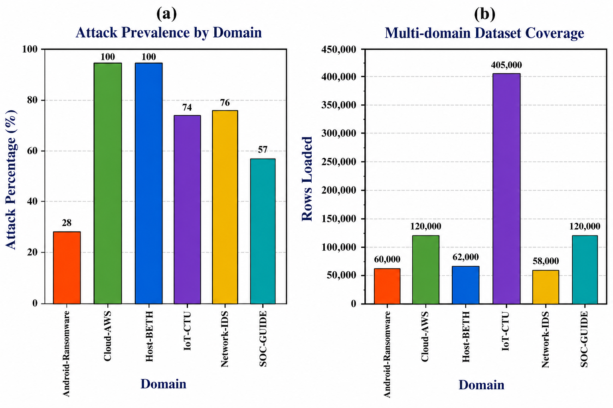
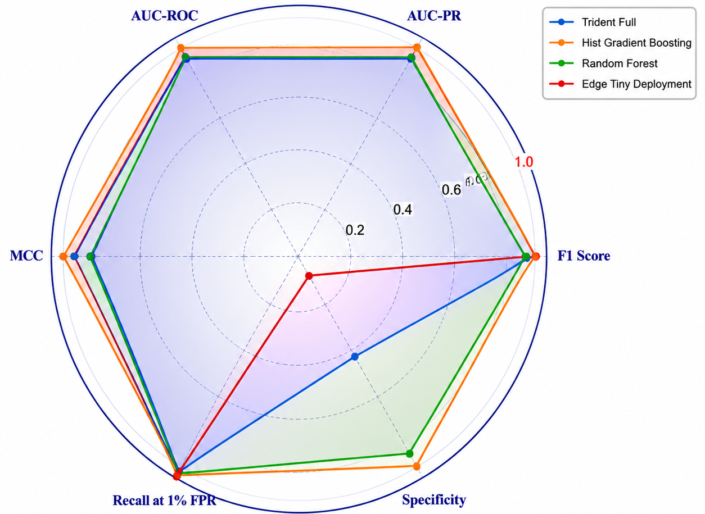
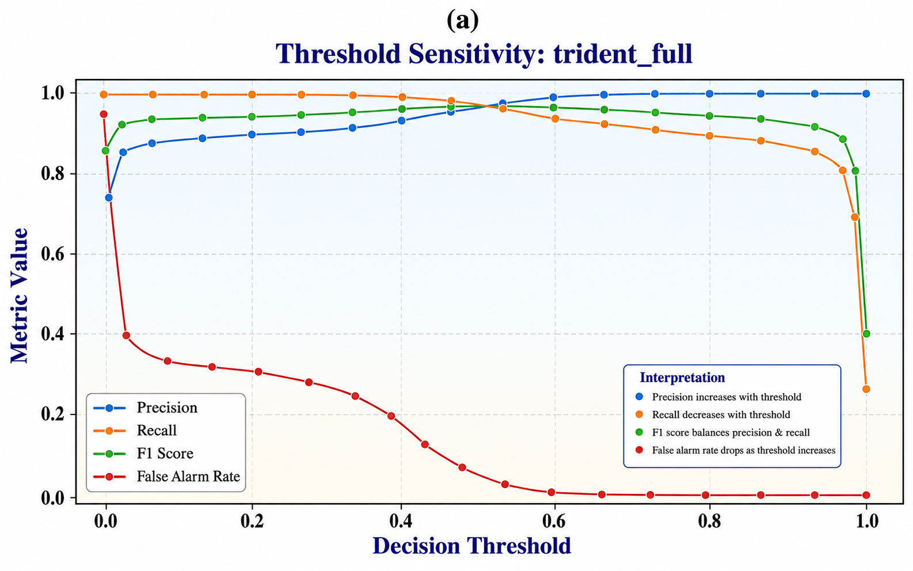
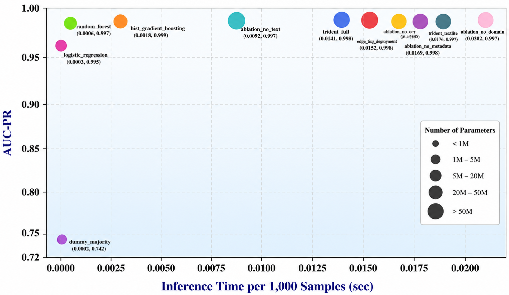

# TRIDENT-APT
### Agentic-TRIDENT-LLM: A Multi-Agent Multi-View Framework for Cross-Domain APT Detection
---

## Overview

Advanced Persistent Threats (APTs) execute long-duration, multi-stage attack campaigns that span heterogeneous cyber environments and continuously change their behavior to evade detection systems.

TRIDENT-APT introduces an agentic, multi-view, and continual learning framework that performs generalized APT detection across multiple cyber domains, including:

- Android malware and ransomware
- Cloud infrastructures
- Host telemetry
- Network intrusion traffic
- Security operation center logs
- IoT environments

The framework integrates heterogeneous cyber telemetry, adaptive representation learning, cross-domain reasoning, and collaborative agents within a unified architecture.

---

## Key Features

- Multi-source cyber telemetry acquisition
- Multi-view representation learning
- Cross-view contextual fusion
- Continual adaptation and drift management
- Agentic reasoning and response orchestration
- Edge deployment support
- Cross-domain APT detection
- Reproducible evaluation pipeline

---

# Proposed Architecture

<p align="center">
  
</p>

The proposed framework consists of six hierarchical layers:

1. Multi-source Cyber Telemetry Acquisition (MCTA)
2. Multi-view Representation Learning (MVRL)
3. Cross-view Fusion and Contextual Reasoning (CVCR)
4. Continual Adaptation and Drift Management (CADM)
5. Agentic Reasoning and Response Orchestration (ARRO)
6. Decision and Deployment Layer

---

# Agentic Architecture

TRIDENT-APT employs five collaborative reasoning agents.

| Agent | Role | Primary Module |
|-------|------|----------------|
| TIA | Telemetry Interpretation Agent | Text Encoder |
| TERA | Threat Evidence Retrieval Agent | Keyword Encoder |
| HPA | Hypothesis Planning Agent | Reconstruction Head |
| RAA | Risk Assessment Agent | Domain Encoder |
| RRA | Response Recommendation Agent | Drift Management |

---

# Main Contributions

- First agentic multi-view framework for generalized APT detection
- Unified learning over heterogeneous cyber telemetry
- Cross-domain adaptation across six security domains
- Continual learning for evolving threat behaviors
- Collaborative reasoning agents for autonomous investigation
- Deployment-aware architecture for resource-constrained environments
- Extensive ablation, robustness, and edge deployment studies

---

# Experimental Datasets

TRIDENT-APT is evaluated on six heterogeneous cyber domains.

| Domain | Representative Datasets |
|--------|------------------------|
| Android Security | Android Ransomware Detection, Android Malware Detection |
| Cloud Security | AWS CloudTrails |
| Host Security | BETH Dataset |
| Network Security | Network Malware Detection, Network Intrusion Detection |
| SOC Analytics | Cybersecurity Suspicious Web Threat Interactions |
| IoT Security | Cybersecurity Intrusion Detection Dataset |

## Dataset Links

### Android Security
- https://www.kaggle.com/datasets/subhajournal/android-ransomware-detection
- https://www.kaggle.com/datasets/subhajournal/android-malware-detection

### Network Security
- https://www.kaggle.com/datasets/agungpambudi/network-malware-detection-connection-analysis
- https://www.kaggle.com/datasets/sampadab17/network-intrusion-detection

### Security Operations Center
- https://www.kaggle.com/datasets/jancsg/cybersecurity-suspicious-web-threat-interactions

### IoT Security
- https://www.kaggle.com/datasets/dnkumars/cybersecurity-intrusion-detection-dataset

### Cloud Security
- https://www.kaggle.com/datasets/nobukim/aws-cloudtrails-dataset-from-flaws-cloud

### Host Security
- https://www.kaggle.com/datasets/katehighnam/beth-dataset

---

# Repository Structure

```text
TRIDENT-APT/
│
├── Code/
│   ├── dataset_inspector.py
│   ├── trident_multi_arch_train.py
│   ├── preprocessing/
│   ├── models/
│   ├── embeddings/
│   ├── training/
│   └── evaluation/
│
├── Results/
│   ├── figures/
│   ├── tables/
│   ├── checkpoints/
│   └── logs/
│
├── trident_apt_architecture.png
├── figure_multidomain_dataset_coverage.png
├── radar_multimetric_comparison.png
├── trident_full_threshold_sensitivity.png
├── pareto_latency_aucpr_params.png
└── README.md
```

---

# Environment Setup

## Create Conda Environment

```bash
conda create -n tridentapt python=3.11 -y
conda activate tridentapt
```

## Install Dependencies

```bash
conda install -y numpy pandas scipy scikit-learn matplotlib seaborn jupyter notebook
```

```bash
pip install torch torchvision torchaudio --index-url https://download.pytorch.org/whl/cu121
pip install transformers sentence-transformers accelerate datasets tokenizers
pip install xgboost lightgbm catboost
pip install plotly umap-learn pyod networkx
pip install torch-geometric tensorboard tqdm rich shap lime
```

## Export Environment

```bash
conda env export > tridentapt_environment.yml
```

---

# Create Project Directories

```bash
mkdir data_inspection preprocessing embeddings models training evaluation figures results logs checkpoints
```

---

# Dataset Inspection

```bash
python Code/dataset_inspector.py
```

---

# Training

```bash
python Code/trident_multi_arch_train.py ^
 --data_root "Dataset" ^
 --out_dir "Results" ^
 --mode ablation ^
 --epochs 10
```

---

# Experimental Results

## Cross-Domain Dataset Coverage

<p align="center">

</p>

The evaluation spans Android, Cloud, Host, Network, SOC, and IoT domains and creates a heterogeneous environment for generalized APT detection.

---

## Multi-Metric Comparison

<p align="center">

</p>

TRIDENT-APT maintains balanced performance across:

- F1-score
- AUC-PR
- AUC-ROC
- MCC
- Recall@1%FPR
- Specificity

---

## Threshold Sensitivity Analysis

<p align="center">

</p>

TRIDENT-APT preserves high precision and stable F1 performance under varying decision thresholds while maintaining a low false alarm rate.

---

## Deployment Pareto Analysis

<p align="center">

</p>

The framework maintains strong predictive capability while remaining suitable for resource-constrained deployment scenarios.

---

# Performance Summary

| Metric | TRIDENT-APT |
|--------|-------------|
| F1-score | 0.99 |
| Precision | 0.9999 |
| Specificity | 0.9999 |
| False Alarm Rate | 0.00003 |
| Recall | 0.2443 |

---

# Reproducibility

All experiments can be reproduced using:

```bash
python Code/trident_multi_arch_train.py --mode ablation
```

The repository includes:

- Source code
- Dataset processing scripts
- Trained models
- Figures
- Experimental tables
- Ablation studies
- Deployment evaluation
- Statistical robustness analysis

---

# Citation

```bibtex
@article{khan2026tridentapt,
  title={Agentic-TRIDENT-LLM: A Multi-Agent Multi-View Cyber Foundation Model for Cross-Domain Advanced Persistent Threat Detection},
  author={Khan, Ajmal and Khan, Misha Urooj and Iqbal, Naveed and Ahmad, Muneer and Kaleem, Zeeshan},
  journal={IEEE Transactions on Information Forensics and Security},
  year={2026}
}
```

---

# License

This repository is released for academic and research purposes.

---

# Contact

**Misha Urooj Khan**  
European Organization for Nuclear Research (CERN), Switzerland

GitHub: https://github.com/mishaurooj/TRIDENT-APT
